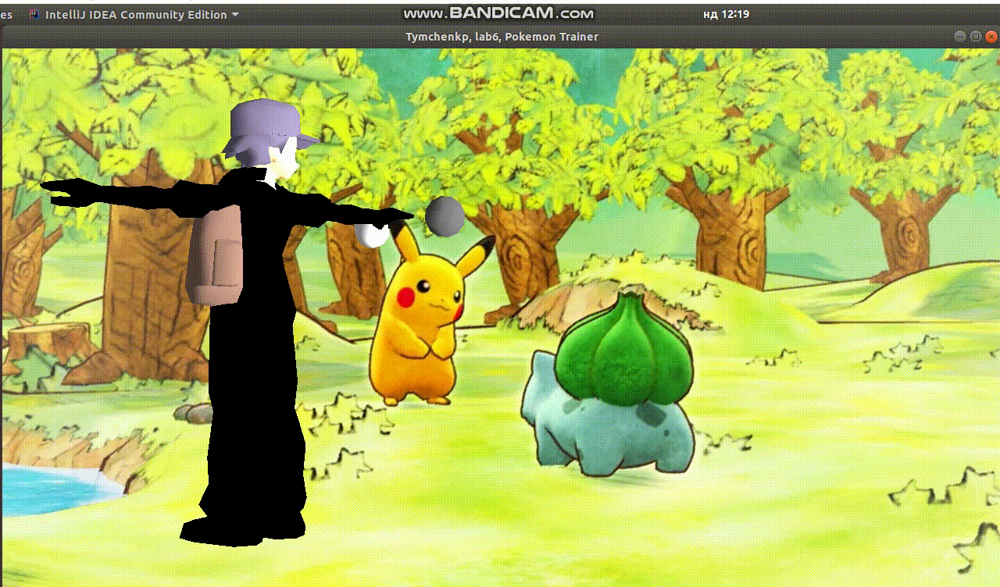

# LAB 6
# Виконав Тимченко Дмитро Олександрович, КП-73
## Task

[Link to the task](http://www.fpm.kpi.ua/archive/dir.do?sys_id=obj_16475)

## Тренер покемонів, 18 варіант

## Виникла проблема з тим, що за завданням повинні бути рухи руками, але файл моделі містив лише тіло повністю (крім голови). Тому виконано рухи всім тілом (в тому числі руками). 

## Результат

